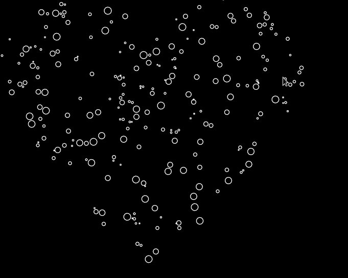

# Circle packing

I was inspired by this video "[Coding Challenge #50.1: Animated Circle Packing](https://www.youtube.com/watch?v=QHEQuoIKgNE)".
So yeah, this is my implementation of that, but with Lua and a couple extra features.

## Starting

To run this project you need to install [Love2D](https://love2d.org) yourself.
There is a great tutorial on how to do all of this [here](https://love2d.org/wiki/Getting_Started).

